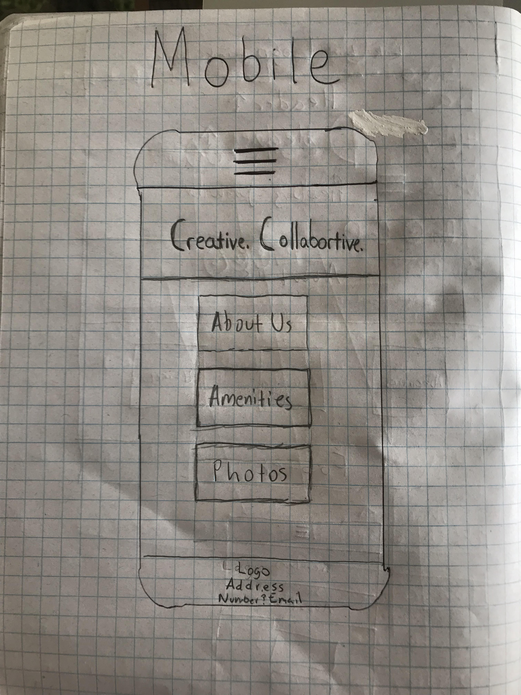
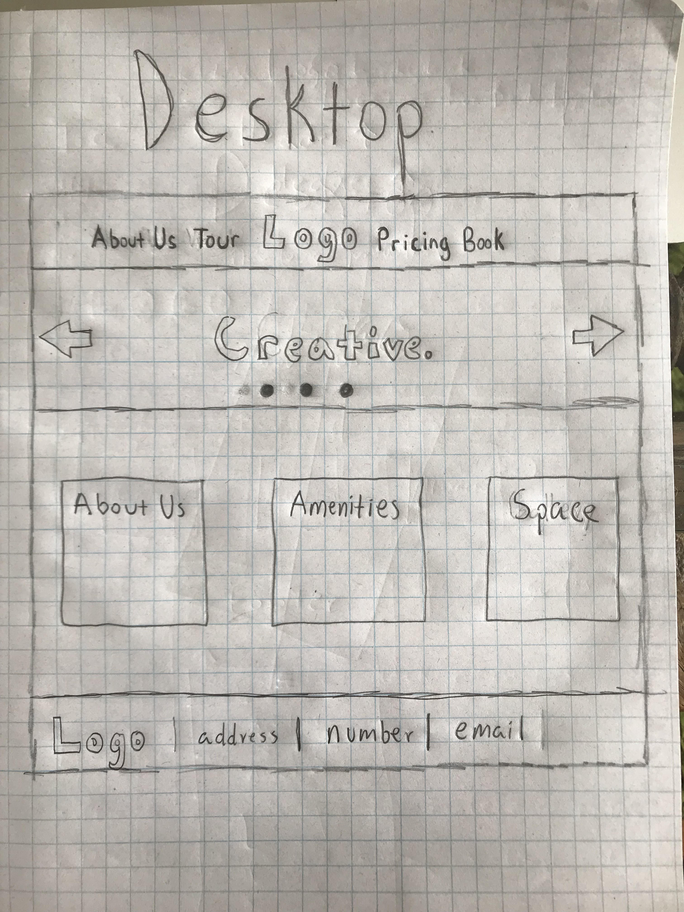

# _Co-Working Space_

#### _A mock up of a new co-working space coming to the Portland area._

#### By _**Brendan Shea**_

## Description

_This project is mock-up of a fictional co-working space that's coming to the Portland area. The project includes user stories, research, mock-ups in Sketch, prototyping in Sketch, and fully functioning website._

## User Stories

## Creative Research & Process

_In order to get a feel for the market and the types of companies that are offering co-working spaces, I reviewed the following websites for information and inspiration:_

* [The Encorepreneur Cafe](http://encorepreneurcafe.com/)
* [TechSpace](https://www.techspace.com/)
* [WeWork](https://www.wework.com/)
* [Centrl Office](https://centrloffice.com/)
* [Harvard Business Review](https://hbr.org/2015/05/why-people-thrive-in-coworking-spaces)

_After reading through and reviewing those resources, I decided that my landing page should be more of a digital experience. I want the user to feel something when they open up the website. I want them to see themselves at this space and creating work that is meaningful to them._

_Once I had a feel for the layouts, I began sketching up a very rough draft on what my site will look like on both mobile and web:_

## Wireframing with Sketch

_I used Sketch on thos project to wireframe the different viewports a user will use with this application. First off, let's take a look at the mobile viewport:_

_Second, let's take a look at the desktop viewport:_

_As you'll see, the mobile viewport condenses into a smaller version of the desktop viewport. The only real change is that the header will turn into a hamburger icon when the user is viewing the website from a mobile device or shrinks their viewport manually._
