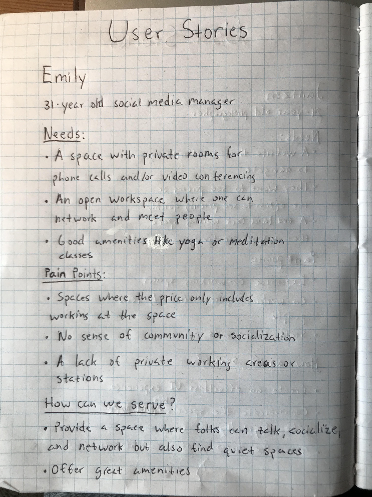
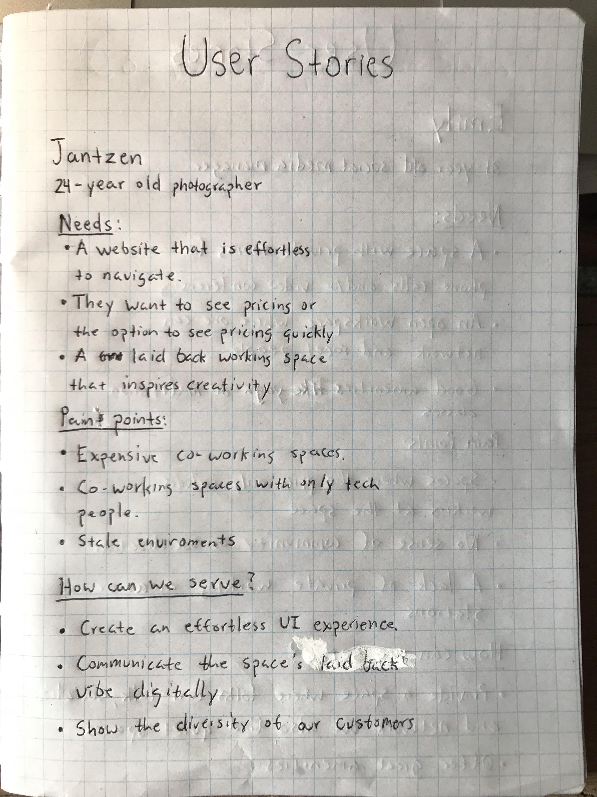
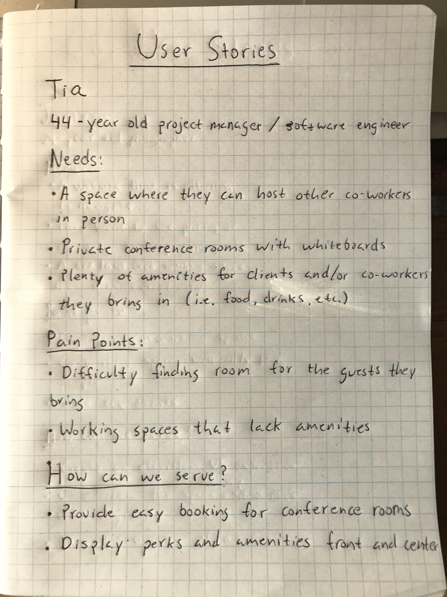
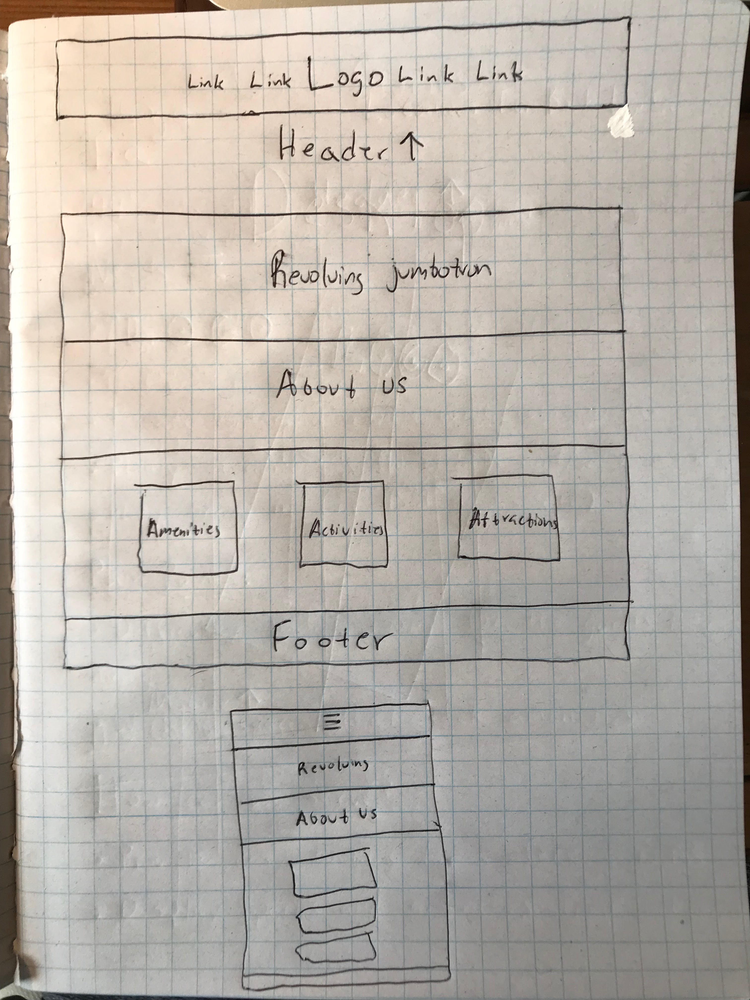

# _Co-Working Space_

#### _A mock up of a new co-working space coming to the Portland area._

#### By _**Brendan Shea**_

## Description

_This project is mock-up of a fictional co-working space that's coming to the Portland area. The project includes user stories, research, mock-ups in Sketch, prototyping in Sketch, and fully functioning website._

## User Stories

## Creative Research & Process

_In order to get a feel for the market and the types of companies that are offering co-working spaces, I looked into the following companies for inspiration and research:_

[The Encorepreneur Cafe](http://encorepreneurcafe.com/)
[TechSpace](https://www.techspace.com/)
[WeWork](https://www.wework.com/)
[Centrl Office](https://centrloffice.com/)

_Once I had a feel for the layouts and what users expected to find on a company's website, I began sketching up a *very* rough draft on what my site will look like:_

